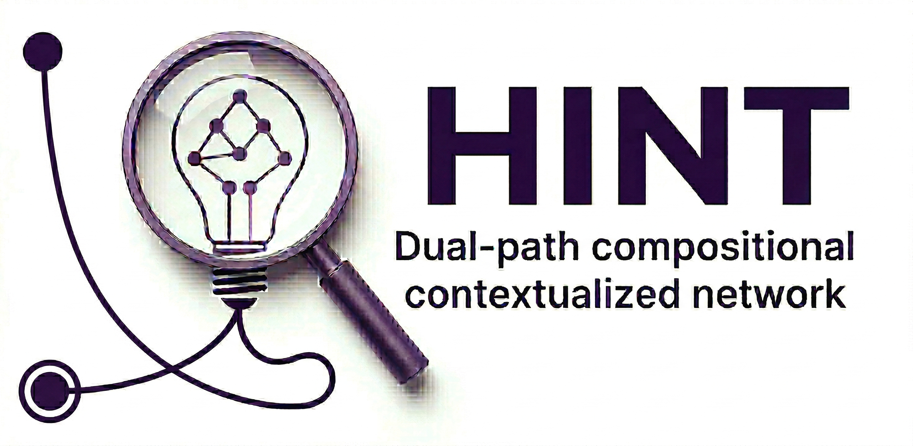
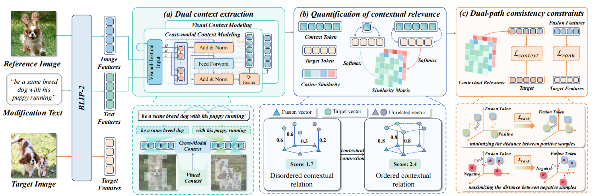
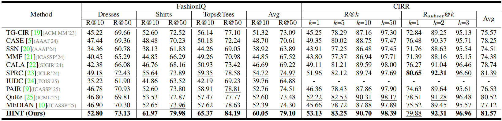

<a id="top"></a>
<div align="center">
   
  
  <h1>(ICASSP 2026) HINT: Composed Image Retrieval with Dual-Path Compositional Contextualized Network</h1>
  
  <p>
      <a href="https://2026.ieeeicassp.org/"></a>
      <a href="https://arxiv.org/abs/coming soon"></a>
      <a href="[TODO: 论文正式PDF链接]"></a>
    <a href="https://zh-mingyu.github.id/HINT.github.io"></a>
    <a href="https://zh-mingyu.github.id"></a>
    <a href="https://pytorch.org/get-started/locally"></a>
    
    <a href="https://github.com/"></a>
  </p>

  <p>
    <b>Accepted by ICASSP 2026:</b> A novel contextualized network tackling the neglect of contextual information in Composed Image Retrieval (CIR) by amplifying similarity differences between matching and non-matching samples.
  </p>
</div>


## 📌 Introduction

**HINT** (dual-patH composItional coNtextualized neTwork) is our proposed framework for Composed Image Retrieval (CIR), accepted by ICASSP 2026. Although existing methods have made significant progress, they often neglect contextual information in discriminating matching samples. To address the implicit dependencies and the lack of a differential amplification mechanism, HINT systematically models contextual structure to improve the upper performance of CIR models in complex scenarios.

[⬆ Back to top](#top)

## 📢 News
* **[2026-03-26]** 🚀 Initial setup for the HINT repository. Source code is scheduled for release in April 2026.
* **[2026-01-18]** 🔥 Our paper *"HINT: COMPOSED IMAGE RETRIEVAL WITH DUAL-PATH COMPOSITIONAL CONTEXTUALIZED NETWORK"* has been accepted by **ICASSP 2026**!

[⬆ Back to top](#top)

## ✨ Key Features

  - 🧠 **Dual Context Extraction (DCE)**: Extracts both intra-modal context and cross-modal context, enhancing joint semantic representation by integrating multimodal contextual information.
  - 📏 **Quantification of Contextual Relevance (QCR)**: Evaluates the relevance between cross-modal contextual information and the target image semantics, enabling the quantification of implicit dependencies.
  - 🛡️ **Dual-Path Consistency Constraints (DPCC)**: Optimizes the training process by constraining the representation consistency between multimodal fusion features and the target, ensuring the stable enhancement of similarity for matching instances while lowering the similarity for non-matching instances.
  - 🏆 **Outstanding Performance**: Achieves competitive results on major metrics across two CIR benchmark datasets, FashionIQ and CIRR, demonstrating strong cross-domain generalization ability.

[⬆ Back to top](#top)

## 🏗️ Architecture

<p align="center">
  
  <figcaption><strong>Figure 1.</strong> HINT framework consists of three modules: (a) Dual Context Extraction, (b) Quantification of Contextual Relevance, (c) Dual-Path Consistency Constraints. </figcaption>
</p>

[⬆ Back to top](#top)

## 🏃‍♂️ Experiment-Results

### CIR Task Performance

#### Experimental Results

<caption><strong>Table 1.</strong> Performance comparison on FashionIQ and CIRR datasets. HINT achieves a notable relative increase of approximately 9.74% in average R@10 on FashionIQ, and a 1.74% improvement in R@1 on the CIRR test set.</caption>

<p align="center">
  
</p>

[⬆ Back to top](#top)

---

## 🔗 Related Projects

*Ecosystem & Other Works from our Team*
<table style="width:100%; border:none; text-align:center; background-color:transparent;">
  <tr style="border:none;">
    <td style="width:30%; border:none; vertical-align:top; padding-top:30px;">
      <br>
      <b>ReTrack (AAAI'26)</b><br>
      <span style="font-size: 0.9em;">
        <a href="[https://lee-zixu.github.io/ReTrack.github.io/](https://lee-zixu.github.io/ReTrack.github.io/)" target="_blank">Web</a> | 
        <a href="[https://github.com/Lee-zixu/ReTrack](https://github.com/Lee-zixu/ReTrack)" target="_blank">Code</a> | 
        <a href="[https://ojs.aaai.org/index.php/AAAI/article/view/39507](https://ojs.aaai.org/index.php/AAAI/article/view/39507)" target="_blank">Paper</a>
      </span>
    </td>
    <td style="width:30%; border:none; vertical-align:top; padding-top:30px;">
      <br>
      <b>INTENT (AAAI'26)</b><br>
      <span style="font-size: 0.9em;">
        <a href="[https://zivchen-ty.github.io/INTENT.github.io/](https://zivchen-ty.github.io/INTENT.github.io/)" target="_blank">Web</a> | 
        <a href="[https://github.com/ZivChen-Ty/INTENT](https://github.com/ZivChen-Ty/INTENT)" target="_blank">Code</a> | 
        <a href="[https://ojs.aaai.org/index.php/AAAI/article/view/39181](https://ojs.aaai.org/index.php/AAAI/article/view/39181)" target="_blank">Paper</a>
      </span>
    </td>  
    <td style="width:30%; border:none; vertical-align:top; padding-top:30px;">
      <br>
      <b>ENCODER (AAAI'25)</b><br>
      <span style="font-size: 0.9em;">
        <a href="[https://sdu-l.github.io/ENCODER.github.io/](https://sdu-l.github.io/ENCODER.github.io/)" target="_blank">Web</a> | 
        <a href="[https://github.com/Lee-zixu/ENCODER](https://github.com/Lee-zixu/ENCODER)" target="_blank">Code</a> | 
        <a href="[https://ojs.aaai.org/index.php/AAAI/article/view/32541](https://ojs.aaai.org/index.php/AAAI/article/view/32541)" target="_blank">Paper</a>
      </span>
    </td>
  </tr>
</table>

## 📝⭐️ Citation

If you find our work or this code useful in your research, please consider leaving a **Star**⭐️ or **Citing**📝 our paper 🥰. Your support is our greatest motivation!

```bibtex
@inproceedings{HINT2026,
  title={HINT: COMPOSED IMAGE RETRIEVAL WITH DUAL-PATH COMPOSITIONAL CONTEXTUALIZED NETWORK},
  author={Zhang, Mingyu and Li, Zixu and Chen, Zhiwei and Fu, Zhiheng and Zhu, Xiaowei and Nie, Jiajia and Wei, Yinwei and Hu, Yupeng},
  booktitle={Proceedings of the IEEE International Conference on Acoustics, Speech and Signal Processing (ICASSP)},
  year={2026}
}
```

[⬆ Back to top](#top)

<div align="center">
  <br><br>

  <a href="zh-mingyu.github.io/HINT">
    
  </a>
  <a href="zh-mingyu.github.io/HINT/issues">
    
  </a>

  <br><br>
<a href="zh-mingyu.github.io/HINT">
    
  </a>
</div>
